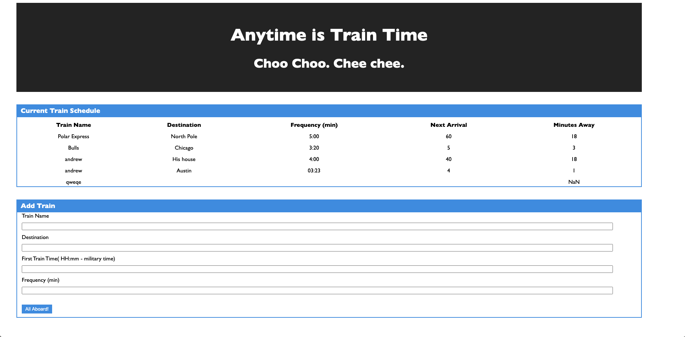

## Train Scheduler

## Screenshots / Gifs

## Motivation
Train Scheduler is a simply web app to practice Google Firebase.

## How to
To use Train Scheduler simply go to https://thagrza.github.io/trainScheduler/ , and enter a Name and Destination for your train, along with it's Time and Frequency!

## Build Status
N/A

## Styling
N/A

## Tech/framework used
<b> Built with </b>
- [Javascript](https://www.javascript.com/)
- [Jquery](https://jquery.com/)
## Features
N/A

## Installation

## API Reference
[Google Firebase](https://firebase.google.com/)

## Credits
Andrew Griswold

## License
This project is covered by the MIT license.
MIT © Andrew Griswold